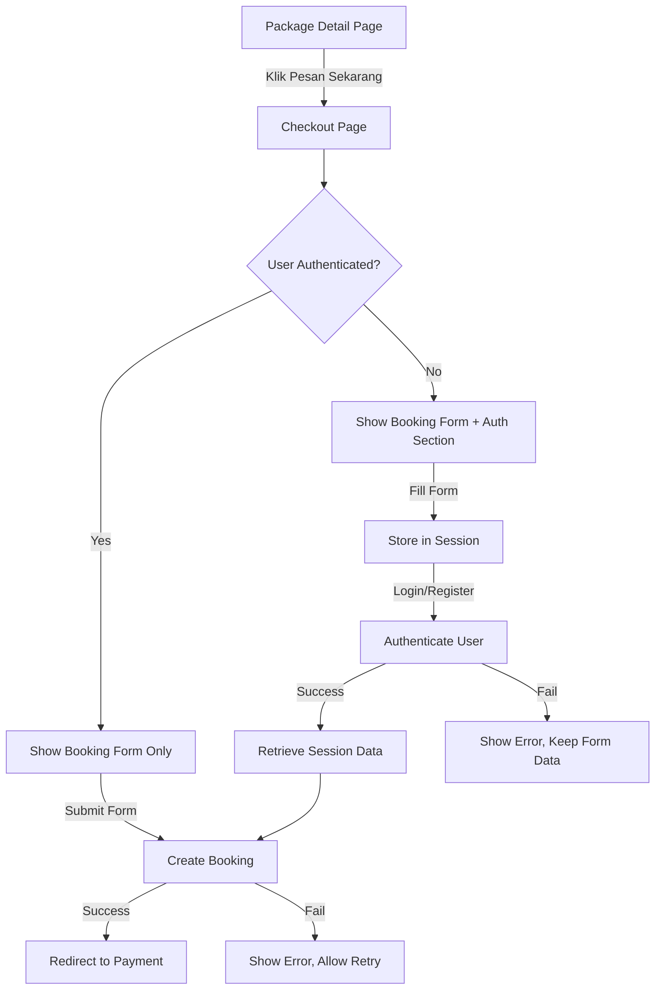

# Design Document: Checkout Flow

## Overview

Fitur ini mengimplementasikan flow checkout yang terintegrasi untuk booking paket wisata, mirip dengan pengalaman checkout e-commerce. User dapat mengisi data booking terlebih dahulu, kemudian login/register jika belum memiliki akun, tanpa kehilangan data yang sudah diisi. Flow ini mengurangi friction dan meningkatkan conversion rate.

## Architecture



## Components and Interfaces

### 1. CheckoutController

Controller baru yang menangani halaman checkout terintegrasi.

```php
<?php

namespace App\Http\Controllers\Front;

class CheckoutController extends Controller
{
    /**
     * Display the checkout page for a package.
     * Shows booking form and auth section (if guest).
     */
    public function show(string $slug): View

    /**
     * Process booking form submission.
     * For guests: store in session and show auth forms.
     * For authenticated: create booking and redirect to payment.
     */
    public function store(Request $request, string $slug): RedirectResponse

    /**
     * Handle inline login on checkout page.
     * Authenticates user and processes pending booking.
     */
    public function login(Request $request, string $slug): RedirectResponse

    /**
     * Handle inline registration on checkout page.
     * Creates user, logs in, and processes pending booking.
     */
    public function register(Request $request, string $slug): RedirectResponse
}
```

### 2. CheckoutSessionService

Service untuk mengelola data booking sementara di session.

```php
<?php

namespace App\Services;

class CheckoutSessionService
{
    private const SESSION_KEY = 'pending_booking';
    private const SESSION_TTL = 30; // minutes

    /**
     * Store booking data in session.
     */
    public function store(array $bookingData, int $packageId): void

    /**
     * Retrieve pending booking data from session.
     */
    public function retrieve(): ?array

    /**
     * Check if there's pending booking data.
     */
    public function hasPendingBooking(): bool

    /**
     * Clear pending booking data from session.
     */
    public function clear(): void

    /**
     * Check if session data is still valid (not expired).
     */
    public function isValid(): bool
}
```

### 3. BookingCreationService

Service untuk membuat booking dari session data atau form submission.

```php
<?php

namespace App\Services;

class BookingCreationService
{
    /**
     * Create booking from validated data.
     * Returns the created booking or throws exception on failure.
     */
    public function createBooking(
        User $user,
        Package $package,
        array $bookingData
    ): Booking

    /**
     * Create booking from pending session data.
     * Retrieves session data, creates booking, and clears session.
     */
    public function createFromSession(User $user): ?Booking

    /**
     * Calculate total price for booking.
     */
    public function calculateTotalPrice(Package $package, int $participants): float
}
```

## Data Models

### Session Data Structure

```php
// Session key: 'pending_booking'
[
    'package_id' => int,
    'package_slug' => string,
    'travel_date' => string (Y-m-d),
    'participants' => int,
    'pickup_location' => string,
    'total_amount' => float,
    'created_at' => timestamp,
]
```

### Request Validation Rules

```php
// CheckoutRequest
[
    'travel_date' => 'required|date|after:today',
    'participants' => 'required|integer|min:1|max:50',
    'pickup_location' => 'required|string|max:500',
]

// CheckoutLoginRequest
[
    'email' => 'required|email',
    'password' => 'required|string',
]

// CheckoutRegisterRequest
[
    'name' => 'required|string|max:255',
    'email' => 'required|email|unique:users',
    'password' => 'required|string|min:8|confirmed',
    'phone' => 'nullable|string|max:20',
]
```

## Correctness Properties

_A property is a characteristic or behavior that should hold true across all valid executions of a system-essentially, a formal statement about what the system should do. Properties serve as the bridge between human-readable specifications and machine-verifiable correctness guarantees._

### Property 1: Checkout Page Rendering Based on Auth State

_For any_ package and any user (authenticated or guest), the checkout page SHALL display the booking form, AND if the user is a guest, the page SHALL also display the auth section (login/register forms).

**Validates: Requirements 1.1, 1.3**

### Property 2: Session Data Persistence

_For any_ valid booking form data submitted by a guest user, the data SHALL be stored in session and SHALL be retrievable until the session expires or is cleared.

**Validates: Requirements 1.2, 2.1**

### Property 3: Guest Authentication Flow Round-Trip

_For any_ guest user who fills the booking form and then successfully authenticates (login or register), the system SHALL create a booking with the exact same data that was stored in session, and SHALL redirect to the payment page.

**Validates: Requirements 2.2, 2.3, 3.5, 4.2**

### Property 4: Authentication Error Handling

_For any_ failed authentication attempt on the checkout page, the booking form data SHALL remain intact and error messages SHALL be displayed inline.

**Validates: Requirements 3.4**

### Property 5: Booking Validation

_For any_ booking form submission (from authenticated user or after guest authentication), the system SHALL validate all required fields and reject invalid data with appropriate error messages.

**Validates: Requirements 4.3**

### Property 6: Price Calculation Consistency

_For any_ package and participant count, the total price displayed on the checkout page SHALL equal the total price stored in the created booking record (price_per_person × participants).

**Validates: Requirements 5.1, 5.2, 5.3**

## Error Handling

### Session Expiration

-   If pending booking session expires (>30 minutes), redirect to package detail page with message: "Sesi checkout telah berakhir. Silakan mulai pemesanan kembali."

### Authentication Failures

-   Invalid credentials: Display inline error, preserve form data
-   Email already exists (registration): Display inline error, suggest login
-   Validation errors: Display field-specific errors inline

### Booking Creation Failures

-   Database error: Display generic error, allow retry
-   Package not found: Redirect to packages list with error message
-   Invalid data: Display validation errors, allow correction

## Testing Strategy

### Unit Tests

-   `CheckoutSessionService`: Test store, retrieve, clear, isValid methods
-   `BookingCreationService`: Test createBooking, calculateTotalPrice methods
-   Price calculation logic

### Property-Based Tests

-   Property 1: Generate random auth states, verify page content
-   Property 2: Generate random booking data, verify session persistence
-   Property 3: Generate random guest flows, verify booking creation matches session
-   Property 6: Generate random packages and participant counts, verify price consistency

### Integration Tests

-   Complete checkout flow for authenticated user
-   Complete checkout flow for guest user (login path)
-   Complete checkout flow for guest user (register path)
-   Session expiration handling
-   Authentication error handling

### Testing Framework

-   PHPUnit for unit and integration tests
-   Pest PHP for property-based tests (using `pest-plugin-faker` for data generation)
