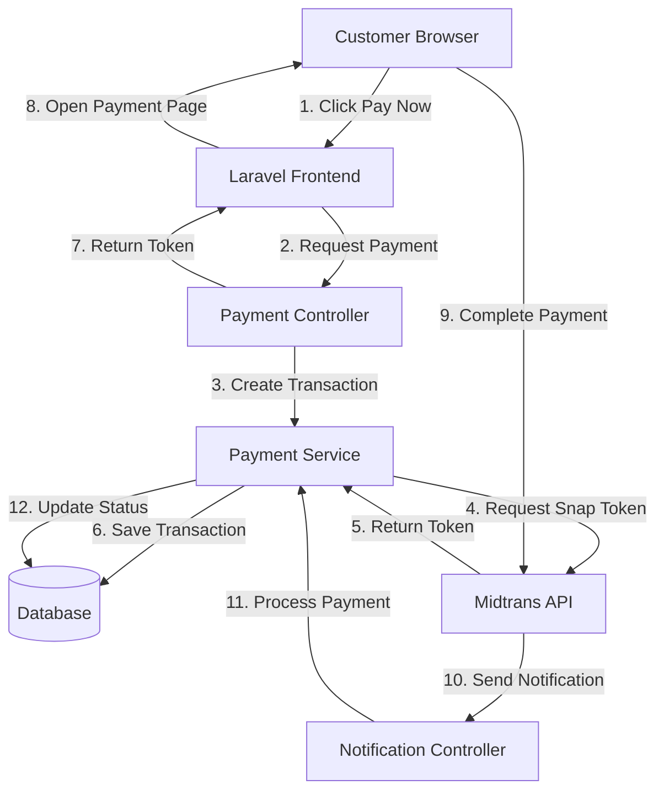

# Design Document: Payment Integration

## Overview

Payment Integration system mengintegrasikan Midtrans payment gateway ke dalam Travel Package Booking System. Sistem ini menggunakan Midtrans Snap untuk menyediakan payment page yang user-friendly dengan berbagai metode pembayaran. Arsitektur dirancang dengan separation of concerns: payment service untuk business logic, controller untuk HTTP handling, dan event-driven notification processing untuk webhook dari Midtrans.

Sistem menggunakan Laravel framework dengan Eloquent ORM untuk data persistence, dan Filament untuk admin interface. Payment flow mengikuti pattern: Request Snap Token → Display Payment Page → Receive Notification → Update Status.

## Architecture

### High-Level Architecture



### Component Architecture

1. **Payment Service Layer**: Core business logic untuk payment processing
2. **HTTP Controllers**: Handle HTTP requests dari customer dan webhook dari Midtrans
3. **Models**: Eloquent models untuk Transaction dan Booking
4. **Midtrans Client**: Wrapper untuk Midtrans API calls
5. **Admin Resources**: Filament resources untuk payment management

### Data Flow

**Payment Initiation Flow:**

1. Customer clicks "Pay Now" button
2. Frontend sends request to PaymentController
3. PaymentController calls PaymentService to create transaction
4. PaymentService generates unique order_id
5. PaymentService calls Midtrans API to get Snap Token
6. PaymentService saves Transaction record
7. Frontend receives Snap Token and opens payment page

**Payment Notification Flow:**

1. Midtrans sends POST request to notification webhook
2. NotificationController receives and validates signature
3. NotificationController calls PaymentService to process notification
4. PaymentService updates Transaction status
5. PaymentService updates Booking status if payment successful
6. System responds with HTTP 200 to Midtrans

## Components and Interfaces

### 1. Payment Service (`App\Services\PaymentService`)

**Responsibilities:**

-   Create payment transactions
-   Generate Snap Tokens from Midtrans
-   Process payment notifications
-   Update transaction and booking status
-   Handle payment retry logic

**Public Methods:**

```php
class PaymentService
{
    /**
     * Create a new payment transaction and get Snap Token
     *
     * @param Booking $booking
     * @return array ['snap_token' => string, 'transaction' => Transaction]
     * @throws PaymentException
     */
    public function createPayment(Booking $booking): array;

    /**
     * Process payment notification from Midtrans
     *
     * @param array $notification
     * @return void
     * @throws InvalidSignatureException
     */
    public function processNotification(array $notification): void;

    /**
     * Check payment status from Midtrans API
     *
     * @param string $orderId
     * @return array
     */
    public function checkPaymentStatus(string $orderId): array;

    /**
     * Retry payment for a booking
     *
     * @param Booking $booking
     * @return array ['snap_token' => string, 'transaction' => Transaction]
     */
    public function retryPayment(Booking $booking): array;
}
```

### 2. Midtrans Client (`App\Services\MidtransClient`)

**Responsibilities:**

-   Handle HTTP communication with Midtrans API
-   Manage authentication with server key
-   Format request/response data

**Public Methods:**

```php
class MidtransClient
{
    /**
     * Request Snap Token from Midtrans
     *
     * @param array $params
     * @return string Snap Token
     * @throws MidtransApiException
     */
    public function getSnapToken(array $params): string;

    /**
     * Get transaction status from Midtrans
     *
     * @param string $orderId
     * @return array
     * @throws MidtransApiException
     */
    public function getTransactionStatus(string $orderId): array;

    /**
     * Verify notification signature
     *
     * @param array $notification
     * @return bool
     */
    public function verifySignature(array $notification): bool;
}
```

### 3. Payment Controller (`App\Http\Controllers\PaymentController`)

**Responsibilities:**

-   Handle payment initiation requests
-   Return Snap Token to frontend
-   Handle payment success/failure callbacks

**Routes:**

```php
POST /payments/create/{booking}  // Create payment and get Snap Token
GET  /payments/finish            // Handle payment finish callback
GET  /payments/unfinish          // Handle payment unfinish callback
GET  /payments/error             // Handle payment error callback
```

### 4. Notification Controller (`App\Http\Controllers\MidtransNotificationController`)

**Responsibilities:**

-   Receive webhook notifications from Midtrans
-   Validate notification authenticity
-   Delegate processing to PaymentService

**Routes:**

```php
POST /midtrans/notification  // Webhook endpoint for Midtrans
```

### 5. Transaction Model (`App\Models\Transaction`)

**Relationships:**

-   `belongsTo(Booking::class)`

**Attributes:**

-   `id`: Primary key
-   `booking_id`: Foreign key to bookings
-   `order_id`: Unique order identifier for Midtrans
-   `snap_token`: Token from Midtrans Snap
-   `gross_amount`: Total payment amount
-   `payment_type`: Payment method used (credit_card, bank_transfer, etc)
-   `transaction_status`: Current status (pending, paid, failed, expired)
-   `transaction_time`: When transaction was created
-   `settlement_time`: When payment was settled
-   `status_code`: Midtrans status code
-   `fraud_status`: Fraud detection status from Midtrans
-   `raw_notification`: JSON of last notification received
-   `timestamps`: created_at, updated_at

### 6. Booking Model Updates

**New Methods:**

```php
class Booking extends Model
{
    /**
     * Get all transactions for this booking
     */
    public function transactions()
    {
        return $this->hasMany(Transaction::class);
    }

    /**
     * Get the latest transaction
     */
    public function latestTransaction()
    {
        return $this->hasOne(Transaction::class)->latestOfMany();
    }

    /**
     * Check if booking has been paid
     */
    public function isPaid(): bool
    {
        return $this->status === 'paid';
    }

    /**
     * Check if booking has pending payment
     */
    public function hasPendingPayment(): bool
    {
        return $this->transactions()
            ->where('transaction_status', 'pending')
            ->exists();
    }
}
```

## Data Models

### Transaction Table Schema

```php
Schema::create('transactions', function (Blueprint $table) {
    $table->id();
    $table->foreignId('booking_id')->constrained()->onDelete('cascade');
    $table->string('order_id')->unique();
    $table->string('snap_token')->nullable();
    $table->decimal('gross_amount', 12, 2);
    $table->string('payment_type')->nullable();
    $table->enum('transaction_status', [
        'pending',
        'paid',
        'failed',
        'expired',
        'superseded'
    ])->default('pending');
    $table->timestamp('transaction_time')->nullable();
    $table->timestamp('settlement_time')->nullable();
    $table->string('status_code')->nullable();
    $table->string('fraud_status')->nullable();
    $table->json('raw_notification')->nullable();
    $table->timestamps();

    $table->index('order_id');
    $table->index(['booking_id', 'transaction_status']);
});
```

### Booking Table Updates

```php
Schema::table('bookings', function (Blueprint $table) {
    $table->timestamp('payment_date')->nullable()->after('status');
});
```

### Configuration Structure

```php
// config/midtrans.php
return [
    'server_key' => env('MIDTRANS_SERVER_KEY'),
    'client_key' => env('MIDTRANS_CLIENT_KEY'),
    'is_production' => env('MIDTRANS_IS_PRODUCTION', false),
    'is_sanitized' => env('MIDTRANS_IS_SANITIZED', true),
    'is_3ds' => env('MIDTRANS_IS_3DS', true),
];
```

## Correctness Properties

_A property is a characteristic or behavior that should hold true across all valid executions of a system—essentially, a formal statement about what the system should do. Properties serve as the bridge between human-readable specifications and machine-verifiable correctness guarantees._

### Property 1: Order ID Uniqueness

_For any_ set of bookings, when creating payment transactions, all generated order_ids must be unique across the entire system.
**Validates: Requirements 1.1**

### Property 2: Transaction Creation Completeness

_For any_ booking, when a Snap Token is requested, the created Transaction must contain all required fields: booking_id, order_id, gross_amount, snap_token, and status must be "pending".
**Validates: Requirements 2.1, 2.2, 2.3**

### Property 3: Amount Consistency

_For any_ transaction, the gross_amount must exactly match the corresponding booking's total_amount.
**Validates: Requirements 2.4, 10.3**

### Property 4: Midtrans API Request Structure

_For any_ payment creation request, the payload sent to Midtrans must include transaction_details (order_id, gross_amount), customer_details (name, email, phone), and item_details (package description).
**Validates: Requirements 3.1, 3.2, 3.3**

### Property 5: Environment-Based Endpoint Selection

_For any_ Midtrans API call, when environment is "sandbox" the system must use sandbox endpoints, and when environment is "production" the system must use production endpoints.
**Validates: Requirements 3.7, 12.4, 12.5**

### Property 6: Signature Verification Requirement

_For any_ incoming payment notification, the system must verify the signature before processing the notification data.
**Validates: Requirements 4.1, 10.1**

### Property 7: Invalid Signature Rejection

_For any_ notification with invalid signature, the system must reject the notification, log the attempt with IP address, and not update any transaction or booking status.
**Validates: Requirements 4.2, 11.3**

### Property 8: Payment Status Mapping

_For any_ valid notification, when transaction_status is "capture" or "settlement" then Transaction status becomes "paid", when transaction_status is "deny", "cancel", or "expire" then Transaction status becomes "failed".
**Validates: Requirements 4.4, 4.6**

### Property 9: Cascading Status Update

_For any_ transaction, when its status changes to "paid", the corresponding booking status must be updated to "paid" and payment_date must be recorded.
**Validates: Requirements 4.7, 5.1, 5.4**

### Property 10: Failed Payment Isolation

_For any_ transaction, when its status becomes "failed", the corresponding booking status must remain "pending" (not changed to failed).
**Validates: Requirements 5.2**

### Property 11: Latest Transaction Priority

_For any_ booking with multiple transactions, only the latest transaction with status "paid" should update the booking status to "paid".
**Validates: Requirements 5.3**

### Property 12: Status Immutability

_For any_ booking, once its status becomes "paid", it cannot be changed back to "pending" regardless of subsequent transaction failures.
**Validates: Requirements 5.5**

### Property 13: Webhook Response Consistency

_For any_ valid notification (regardless of payment status), the system must respond with HTTP 200 to acknowledge receipt.
**Validates: Requirements 4.8**

### Property 14: Payment Retry Creates New Transaction

_For any_ booking with failed or expired transaction, when customer retries payment, the system must generate a new Snap Token, create a new Transaction record, mark the previous transaction as "superseded", and use the same booking_id.
**Validates: Requirements 8.1, 8.2, 8.3, 8.4, 8.5**

### Property 15: Transaction Expiry Handling

_For any_ transaction, when it expires, the status must be updated to "expired" and the customer must be allowed to retry payment.
**Validates: Requirements 9.2, 9.3**

### Property 16: Order ID Validation

_For any_ incoming notification, the system must validate that the order_id exists in the database before processing the payment status update.
**Validates: Requirements 10.2**

### Property 17: Amount Mismatch Detection

_For any_ notification, when the gross_amount in the notification does not match the transaction's stored amount, the system must reject the payment and log the incident as potential fraud.
**Validates: Requirements 10.4**

### Property 18: Input Sanitization

_For any_ notification data received from Midtrans, all input fields must be sanitized before being stored or processed.
**Validates: Requirements 10.7**

### Property 19: Error Logging Completeness

_For any_ Midtrans API call failure, notification processing failure, or signature verification failure, the system must log the error with full context including timestamp, error message, and relevant identifiers.
**Validates: Requirements 11.1, 11.2, 11.4**

### Property 20: Raw Notification Persistence

_For any_ valid notification received, the system must store the complete raw notification payload in the transaction record for debugging purposes.
**Validates: Requirements 11.5**

### Property 21: Conditional UI Rendering

_For any_ booking, when status is "pending" and no paid transaction exists, the UI must display "Pay Now" button; when status is "paid", the UI must display "Paid" badge and hide the payment button; when latest transaction is "failed", the UI must show "Payment Failed" message and allow retry.
**Validates: Requirements 1.2, 6.2, 6.3, 6.4**

### Property 22: Payment Method Display

_For any_ transaction with payment_type populated, the UI must display the payment method used when showing payment status.
**Validates: Requirements 2.5, 6.5**

### Property 23: Error Handling Gracefully

_For any_ Snap Token generation failure or Midtrans API error, the system must display a user-friendly error message to the customer and log the failure without crashing.
**Validates: Requirements 1.5, 3.5**

## Error Handling

### API Communication Errors

**Midtrans API Timeout:**

-   Retry mechanism with exponential backoff (3 attempts)
-   Log timeout with full request context
-   Display user-friendly message: "Payment service is temporarily unavailable"
-   Allow customer to retry payment later

**Midtrans API Error Response:**

-   Parse error message from Midtrans response
-   Log error code and message
-   Display specific error to customer when possible
-   Fallback to generic error message for unknown errors

**Network Errors:**

-   Catch connection exceptions
-   Log network error details
-   Display: "Unable to connect to payment service"
-   Provide retry option

### Notification Processing Errors

**Invalid Signature:**

-   Reject notification immediately
-   Log attempt with IP address, timestamp, and notification data
-   Respond with HTTP 403 Forbidden
-   Alert admin if multiple invalid attempts detected

**Missing Required Fields:**

-   Log incomplete notification
-   Respond with HTTP 400 Bad Request
-   Do not update any transaction status

**Order ID Not Found:**

-   Log orphaned notification
-   Respond with HTTP 404 Not Found
-   Store notification for manual review

**Amount Mismatch:**

-   Log as potential fraud attempt
-   Do not update transaction status
-   Alert admin immediately
-   Respond with HTTP 400 Bad Request

### Database Errors

**Transaction Creation Failure:**

-   Rollback any partial changes
-   Log database error
-   Display: "Unable to create payment. Please try again."
-   Do not call Midtrans API if transaction cannot be saved

**Status Update Failure:**

-   Log error with transaction details
-   Retry status update (3 attempts)
-   If all retries fail, queue for manual processing
-   Respond with HTTP 200 to Midtrans (to prevent retries)

### Validation Errors

**Invalid Booking State:**

-   Check if booking is already paid
-   Display: "This booking has already been paid"
-   Prevent duplicate payment attempts

**Expired Booking:**

-   Check if travel_date has passed
-   Display: "Cannot pay for past bookings"
-   Suggest contacting support

**Invalid Amount:**

-   Validate amount is positive and matches booking
-   Display: "Invalid payment amount"
-   Log validation failure

## Testing Strategy

### Unit Testing

Unit tests will verify specific examples, edge cases, and error conditions for individual components:

**PaymentService Tests:**

-   Test order ID generation produces valid format
-   Test Snap Token request with valid booking
-   Test notification processing with various status codes
-   Test retry payment creates new transaction
-   Test amount validation catches mismatches
-   Test error handling for API failures

**MidtransClient Tests:**

-   Test signature verification with valid/invalid signatures
-   Test API request formatting
-   Test endpoint selection based on environment
-   Test error response parsing

**Transaction Model Tests:**

-   Test relationship with Booking
-   Test status transitions
-   Test query scopes for filtering

**Controller Tests:**

-   Test payment creation endpoint
-   Test notification webhook endpoint
-   Test authentication and authorization
-   Test response formats

### Property-Based Testing

Property tests will verify universal properties across all inputs using PHPUnit with appropriate data generators:

**Configuration:**

-   Minimum 100 iterations per property test
-   Use Laravel's database transactions for test isolation
-   Mock Midtrans API calls to avoid external dependencies
-   Generate random but valid test data

**Test Tagging:**
Each property test must include a comment referencing the design property:

```php
/**
 * @test
 * Feature: payment-integration, Property 1: Order ID Uniqueness
 */
```

**Key Properties to Test:**

-   Property 1: Generate multiple bookings and verify all order IDs are unique
-   Property 3: Generate random amounts and verify transaction amounts match bookings
-   Property 8: Generate notifications with various statuses and verify correct mapping
-   Property 12: Attempt to downgrade paid booking status and verify it's prevented
-   Property 14: Test retry flow creates new transaction and marks old as superseded
-   Property 17: Generate mismatched amounts and verify rejection

**Data Generators:**

-   Random booking data with valid amounts
-   Random notification payloads with various statuses
-   Random valid and invalid signatures
-   Random transaction states

### Integration Testing

Integration tests will verify component interactions:

**Payment Flow Integration:**

-   Test complete flow: create booking → create payment → receive notification → update status
-   Test with mocked Midtrans API
-   Verify database state at each step

**Webhook Integration:**

-   Test notification endpoint with various payloads
-   Verify signature verification
-   Verify status updates propagate correctly

**Admin Interface Integration:**

-   Test Filament resources display correct data
-   Test manual status check functionality

### Manual Testing Checklist

**Sandbox Testing:**

-   Create booking and initiate payment
-   Complete payment with test credit card
-   Verify notification received and processed
-   Verify booking status updated to paid
-   Test failed payment scenario
-   Test payment retry after failure
-   Test payment expiration

**Production Readiness:**

-   Verify environment variables configured
-   Test with Midtrans sandbox first
-   Monitor logs for errors
-   Test notification endpoint accessibility
-   Verify HTTPS configuration

## Implementation Notes

### Midtrans SDK

Use official Midtrans PHP SDK via Composer:

```bash
composer require midtrans/midtrans-php
```

### Order ID Format

Generate order IDs with format: `BOOK-{booking_id}-{timestamp}-{random}`
Example: `BOOK-123-1703750400-a8f3`

This ensures:

-   Uniqueness through timestamp and random component
-   Traceability through booking_id
-   Readability for debugging

### Notification Endpoint Security

-   Use Laravel's CSRF exemption for webhook endpoint
-   Implement signature verification as primary security
-   Log all notification attempts
-   Rate limit notification endpoint to prevent abuse

### Database Indexes

Add indexes for performance:

-   `transactions.order_id` (unique)
-   `transactions.booking_id, transaction_status` (composite)
-   `bookings.status, payment_date` (composite)

### Caching Considerations

-   Do not cache transaction status (must be real-time)
-   Cache Midtrans configuration to reduce file reads
-   Cache booking data during payment creation (short TTL)

### Monitoring and Alerts

**Key Metrics to Monitor:**

-   Payment success rate
-   Average payment processing time
-   Failed signature verification attempts
-   API error rates
-   Notification processing delays

**Alert Conditions:**

-   Multiple invalid signature attempts from same IP
-   Payment success rate drops below threshold
-   Midtrans API errors exceed threshold
-   Amount mismatch detected (potential fraud)
